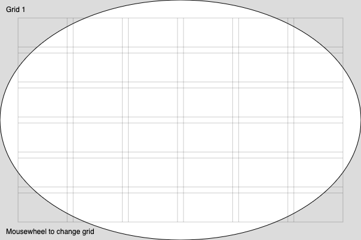
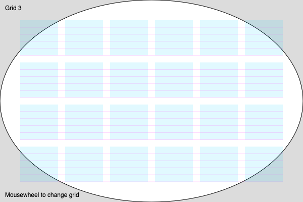

# Grid design class for p5.js

This project is part of the Creative Coding series and focuses on implementing a Grid class in JavaScript to be used with p5.js. The Grid class is designed to help vizualize and manipulate 2D grids in a simple and efficient way to create grid-based designs.

## Features

- Create a grid of any size
- Access and modify grid cells
- Support for various grid properties (margin, gutter, flow lines)

## Installation

To use the Grid class in your project, simply clone this repository and include the `Grid.js` file in your project.

```bash
git clone https://github.com/prossel/p5-grid-design-class.git
```

Or you can link the Grid class directly from the GitHub repository:

```html
<script src="https://prossel.github.io/p5-grid-design-class/src/Grid.js"></script>
```

## Usage

Here is a basic example of how to use the Grid class:

```javascript
function setup() {
  createCanvas(600, 400);

  // Default grid
  grid1 = new Grid();
}

function draw() {
  background(220);

  ellipse(width / 2, height / 2, width, height);

  // Draw the grid
  grid1.draw();
}
```


Example 1: Default grid with 6 columns and 6 rows

## Example 2

Parmeters can be passed to the Grid constructor to customize the grid:

```javascript
  // Custom grid size
  grid2 = new Grid({
    gutter: 20,
    margin: 40,
    columns: 6,
    rows: 4,
  });
```


Custom number of columns and rows with margin and gutter

## Example 3

Customize colors and add flow lines

```javascript
  // Colored modules with transparent grid and flow lines
  grid3 = new Grid({
    gutter: 100, // any value will be overriden by the flow lines height
    margin: 40,
    columns: 6,
    rows: 4,
    strokeGrid: null,  // no grid
    flowLines: 5,
    fillModule: color(0, 200, 255, 30)  // set a color to draw the modules
  });

```


Customize colors and add flow lines

See more examples in [sketch.js](src/sketch.js) file.

## Documentation

For detailed documentation on the Grid class methods and properties, please refer to the [documentation](./docs) if available (TODO) or read the code comments in the [Grid.js](./src/Grid.js) file.

## License

This project is licensed under the MIT License.

## Contact

For any questions or suggestions, please open an issue or contact the project maintainer at <https://github.com/prossel/p5-grid-design-class>
